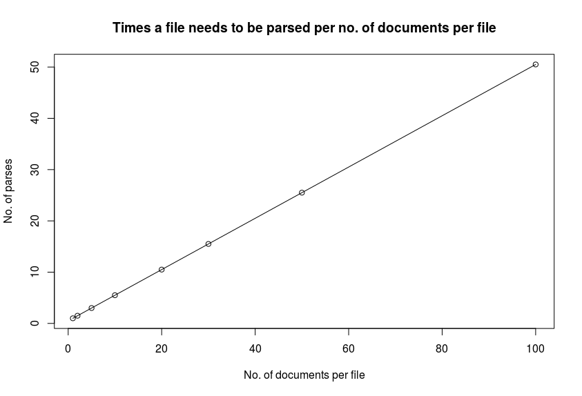

# FLExText Modules for the Pepper conversion framework for linguistic data

## Best practices

### One document per file

As *FLExText* files can contain `n` documents (corresponding to the XML element `interlinear-text`), it is necessary for the import module to parse the file structure as a first step in order to extract the corpus structure. 
During this process, a *Salt* document is created for every `interlinear-text` element in the file, and a *Salt* meta annotation for the document is created from the `guid` attribute of the respective `interlinear-text` element.

In the second step, the import module needs to *parse every file once for every document* in order to create the document structure. 
This is due to the fact that *Pepper* mappers operate on URIs (here, the URI for the *FLExText* file). 
During the parse process, the file is parsed completely up until the parser hits the `interlinear-text` element for the document in question. 
It parses the contents of this element subsequently, and when it hits its end tag (`</interlinear-text`>) it aborts the parse.

This in turn means that if a file contains, e.g., 10 `interlinear-text` elements of approx. the same size, the parser will

1. For the *first* document, parse the whole file until the *first* `interlinear-text` element, parse the element, then abort (i.e., needs to parse ca. 10% of the file).
2. Subsequently, for the *second* document, parse the whole file until the *second* `interlinear-text` element, parse the element, then abort (i.e., needs to parse ca. 20% of the file).
3. Subsequently, for the *third* document, parse the whole file until the *third* `interlinear-text` element, parse the element, then abort (i.e., needs to parse ca. 30% of the file).
4. Subsequently, for *fourth* document, parse the whole file until the *fourth* `interlinear-text` element, parse the element, then abort (i.e., needs to parse ca. 40% of the file).
5. etc.

You can clearly see the problem here: 
In our case, the parser will end up parsing the file *5.5 times* (`10% + 20% + 30% + ... + 100% = 550%`) in order to extract the information for all 10 `interlinear-text` elements. 
This will result in suboptimal performance, especially because the module allows for multithreaded mapping of files!

(Following are approximations for the sake of presentation, not precise data. But this is not a place to discuss processor performance or the details of XML parsing!)

With *one* document per file, every file will need to be parsed only *once*, which results in a considerable reduction of parsing overhead! 
Imagine parsing four files with one document per file.
On a quad-core computer, all four files can be processed simultaneously, with one parse run per file. 
Total parse time is the time it takes to parse the longest file.

Imagine parsing one file containing four documents.
On a quad-core computer, one of the cores will process the file serially, and 2.5 times in total. , henceall four files can be processed simultaneously, with one parse run per file. 
Total parse time is 2.5 the time it takes to parse the file.

Hence, it is strongly suggested that when you export to *FLExText* from *FLEx*, **export one document at a time**!